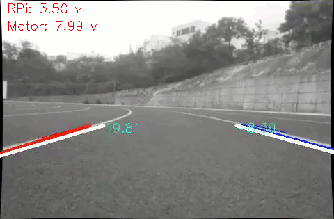
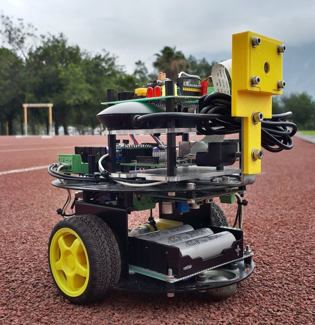
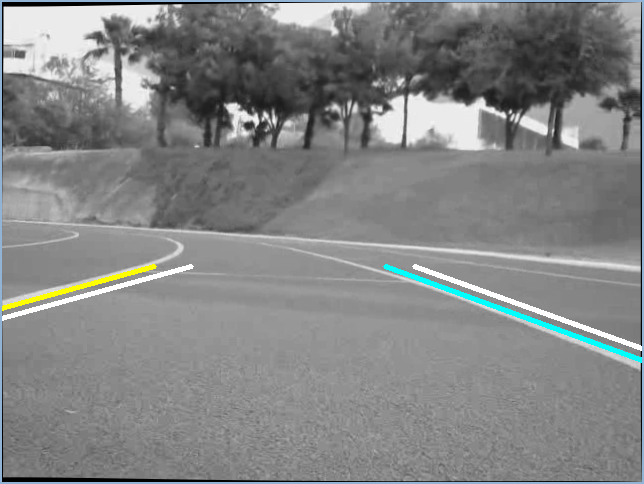
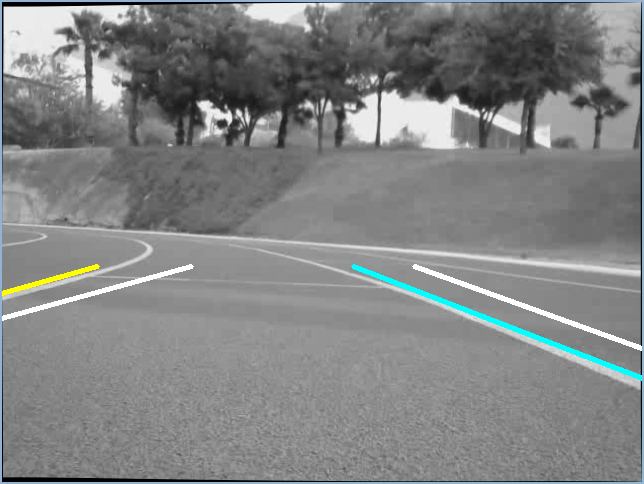
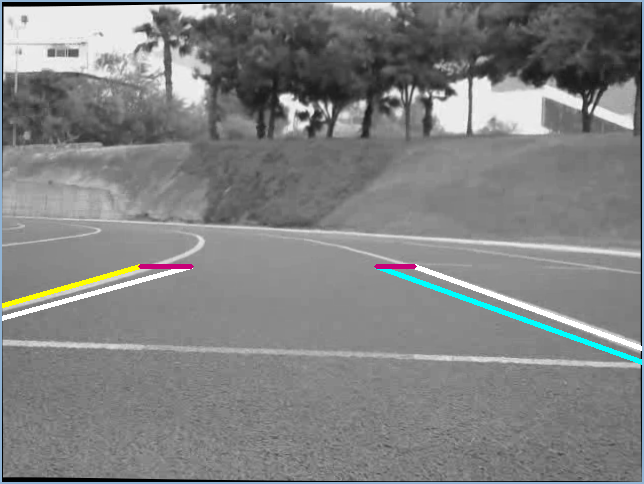

# Lane Tracking and Keeping System for an Autonomous Vehicle

Self-driving vehicle with lane keeping system functionality. The vehicle uses a Kalman Filter for tracking lanes and a single monocular camera for detection purposes. The target platform is a Raspberry Pi 3B+. 

### Prerequisites
- Python 3

### Project Structure

The `src` folder contains the required files for running the lane keeping system on the RPi:

- `car.py`: consists of the interface between `main.py` and the STM-32 controller. When started, it spwans a thread that monitors constantly the serial port for messages. The STM-32 controls the motors' speed and monitors the voltage of the batteries.
- `processor.py`: implements the lane detection algorithms. Output from this class are the detected lanes.
- `tracker.py`: implements the Kalman Filter for processing the output of the Processor class. Outputs the filtered lanes.
- `line.py`: consists of a class for storing the points found via the Hough-Transform. Outputs the first order polynomial that best fits those points.
- `main.py`: entry point for the program. Takes the output from the camera, passes the frame to the processor class, calculates the PID output, and sends the control speed via the car class.

The `stm32` folder contains the source code for the STM-32 microcontroller.

### Working Principle

The main working principle behind the lane keeping system relies on the idea that for a system that estimates the lane position via a first order polynomial, the position of the lanes will always be the same when the vehicle's position is centered on the lanes. This true regardless on the lane curvature. Since the vehicle is moving at a slow speed, such an estimate can be made and produces reliable results. 

The following image shows in white the center position of the lanes, and in yellow and cyan the currently detect lanes. Since the vehicle is relatively centered, the position of the detected and centered lanes is about the same.

In the following image, the vehicle turned suddenly to the right. Therefore, the detected lanes are to the left from the centered lines. By measuring the -x distance from the tip of the centered lanes to the tip of the detected lanes, an indication of how much the vehicle has departed from the center can be estimated.

The -x distance is colored in the following image. This distance will be the input for the PID control loop, also known as the error. The PID control will attempt to minimize this error to zero, thus centering the vehicle on the lanes.

### License

This project is licensed under the MIT License - see the LICENSE file for details.
